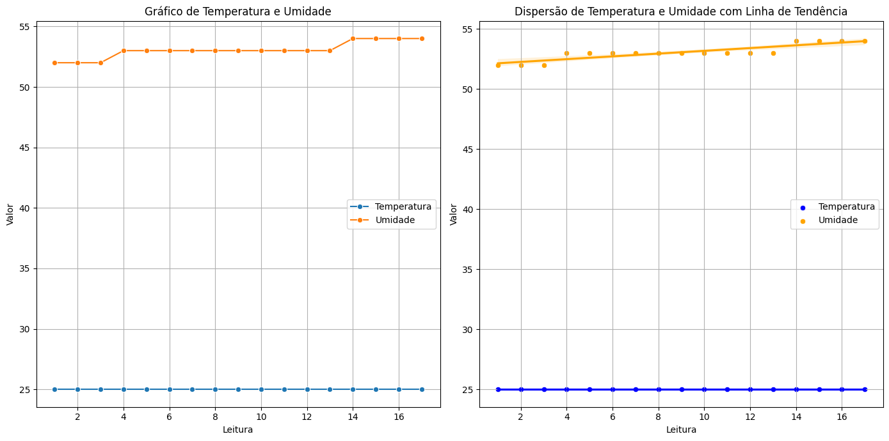

# Oxetech-Arduino-Python
## Descrição

Este projeto tem como objetivo processar e visualizar dados de temperatura e umidade coletados por um datalogger. Utilizando as bibliotecas pandas, matplotlib e seaborn em Python, o script carrega os dados a partir de um arquivo CSV, trata os dados e gera gráficos informativos que ajudam na análise dos dados.

## Origem dos Dados
Os dados utilizados neste projeto foram coletados a partir de um Arduino equipado com um sensor de umidade. O Arduino registra as leituras de temperatura e umidade, que são então armazenadas em um arquivo CSV para posterior análise e visualização.

## Funcionalidades
Carregamento de dados a partir de um arquivo CSV.
Processamento e separação dos dados de temperatura e umidade.
Geração de gráficos:
Gráfico de linhas para visualização direta das leituras.
Gráfico de dispersão com linha de tendência para identificação de tendências nos dados.

## Gráficos Gerados
Gráfico de Linhas: Mostra a variação da temperatura e da umidade ao longo das leituras.
Gráfico de Dispersão com Linha de Tendência: Ajuda a visualizar a distribuição dos dados e tendências.

